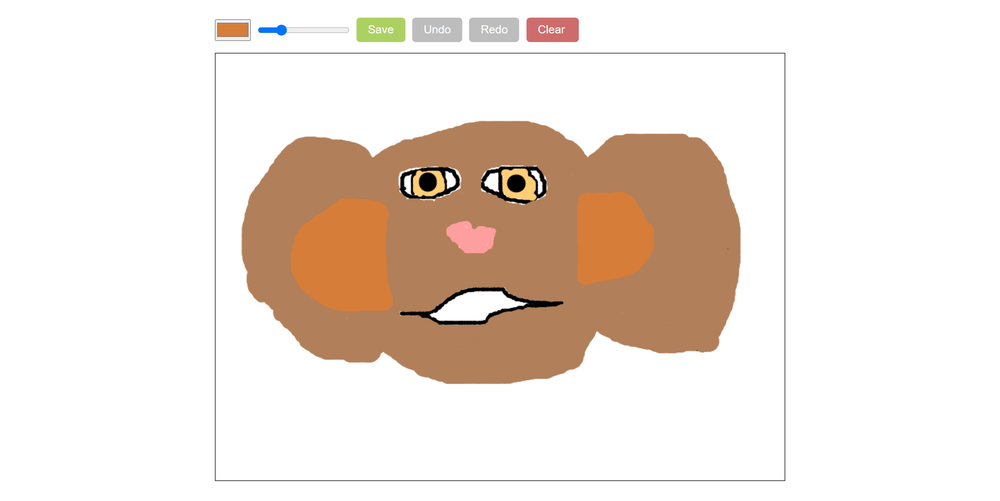

# Canvas drawing element

My first experience with Canvas element. Based on the Udemy [small course](https://www.udemy.com/course/javascript-html5-canvas-course/).

## Description

This is the small app that I made when I started learning the canvas HTML element. To create the app I used HTML, CSS, and JS without any frameworks, libraries, and preprocessors. It is [published](https://vladislavmaksimov.github.io/canvas-drawing-element/) on Github Pages.  

The only page of my application has a simple drawing element. You can create your masterpieces with it using a computer mouse, аs I did.

  

  

There are a default color picker and range input that sets the size of the line you can draw. With **Undo** and **Redo** buttons, you can undo and redo changes you made on the canvas. The **Clear** button removes everything that is now on the canvas.  

Also, you can save your drawing with the **Save** button. All drawings are being saved in png format with a transparent background like my creation below.

  

